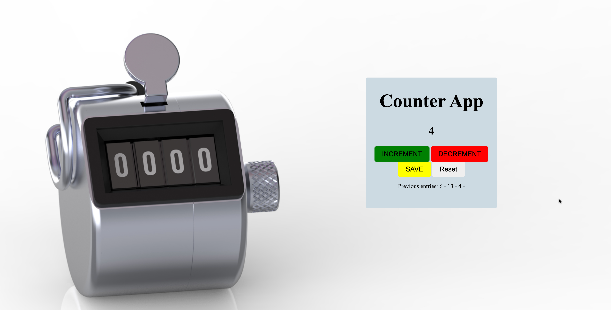

# Simple Counter App

This is a very simple counter application that allows you to increase the counter by 1 by clicking the increment button and decrease the counter by one by clicking the decrement button. The save button logs the current number on the screen and persists all previous numbers.

The Application was made completing Scrimba's first application in the JavaScript course.